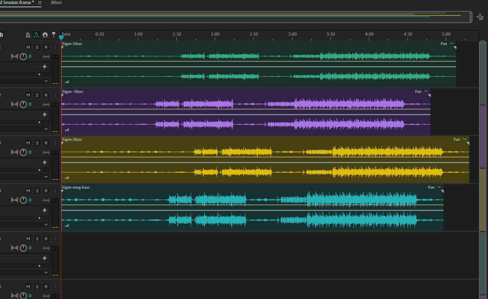

# Audalign

Package for processing and aligning audio files using audio fingerprinting, cross-correlation, cross-correlation with spectrograms, or visual alignment techniques.



This package offers tools to align many recordings of the same event. It has two main purposes: to accurately align recordings, and to process the audio files prior to alignments. All main functions are accessed through functions in the audalign.\_\_init\_\_ file. The recognizers themselves are objects in the recognizer directory which in turn have configurations in the config directories.

 Alignments are primarily accomplished with fingerprinting, though where fingerprinting fails, correlation, correlation with spectrograms, and visual alignment techniques can be used to get a closer result. After an initial alignment is found, that alignment can be passed to "fine_align," which will find smaller, relative alignments to the main one.

---

Each alignment technique has different degrees of adjustment for accuracy settings. Fingerprinting parameters can be generally set to get consistent results using it's config's `set_accuracy` method. Visual alignment has many parameters that can be adjusted and requires case by case adjustment. Parameters for correlation are focused on sample rate or scipy's find_peaks.

[Noisereduce](https://timsainburg.com/noise-reduction-python.html) is very useful for this application and a wrapper is implemented for ease of use. Uniformly leveling prior to noise reduction using uniform_level_file boosts quiet but important sound features.

Alignment and recognition results consist of a dictionary. If an output directory is given, silence is placed before all target files so that they will automatically be aligned and writen to the output directory along with an audio file containing the combined sum. A `rankings` key is included in each alignment and recognition result. This helps determine the strength of the alignment, but is not definitive proof. Values range from 1-10.

---

All formats that ffmpeg or libav support are supported here.

All fingerprints are stored in memory in the `FingerprintRecognzier` and must be saved to disk with the `save_fingerprinted_files` method in order to persist them.

Regular file recogniton can also be done with Audalign similar to [dejavu](https://github.com/worldveil/dejavu).

For more details on implementation and results, see the [wiki!!](https://github.com/benfmiller/audalign/wiki)

## Installation

Install from PyPI:

Don't forget to install ffmpeg/avlib (Below in the Readme)!

```bash
pip install audalign
```

OR

```bash
git clone https://github.com/benfmiller/audalign.git
cd audalign/
pip install audalign
```

OR

Download and extract audalign then

```bash
pip install audalign
```

in the directory

## Recognizers

There are currently four included recognizers, each with their own config objects.

```python
import audalign as ad

fingerprint_rec = ad.FingerprintRecognizer()
correlation_rec = ad.CorrelationRecognizer()
cor_spec_rec = ad.CorrelationSpectrogramRecognizer()
visual_rec = ad.VisualRecognizer()

fingerprint_rec.config.set_accuracy(3)
# recognizer.config.some_item
```

For more info about the configuration objects, check out the [wiki](https://github.com/benfmiller/audalign/wiki) or the config objects themselves. They are relatively nicely commented.

Recognizers are then passed to recognize and align functions.

```python
results = ad.align("target/folder/", recognizer=fingerprint_rec)
results = ad.align("target/folder/", recognizer=correlation_rec)
results = ad.align("target/folder/", recognizer=cor_spec_rec)
results = ad.align("target/folder/", recognizer=visual_rec)
results = ad.recognize("target/file1", "target/file2", recognizer=fingerprint_rec)
results = ad.recognize("target/file1", "target/folder", recognizer=fingerprint_rec)
# or
results = ad.target_align(
    "target/files",
    "target/folder/",
    destination_path="write/alignments/to/folder",
    recognizer=fingerprint_rec
)
# or
results = ad.align_files(
    "target/file1",
    "target/file2",
    destination_path="write/alignments/to/folder",
    recognizer=correlation_rec
)

# results can then be sent to fine_align
fine_results = ad.fine_align(
    results,
    recognizer=cor_spec_rec,
)
```

Correlation is more precise than fingerprints and will always give a best alignment unlike fingerprinting, which can return no alignment. `max_lags` is very important for fine aligning. `locality` can be very useful for all alignments and recognitions.

## Other Functions

```python
# wrapper for timsainb/noisereduce
ad.remove_noise_file(
    "target/file",
    "5", # noise start in seconds
    "20", # noise end in seconds
    "destination/file",
    alt_noise_filepath="different/sound/file",
    prop_decrease="0.5", # If you want noise half reduced
)

ad.remove_noise_directory(
    "target/directory/",
    "noise/file",
    "5", # noise start in seconds
    "20", # noise end in seconds
    "destination/directory",
    prop_decrease="0.5", # If you want noise half reduced
)

ad.uniform_level_file(
    "target/file",
    "destination",
    mode="normalize",
    width=5,
)

ad.plot("file.wav") # Plots spectrogram with peaks overlaid
ad.convert_audio_file("audio.wav", "audio.mp3") # Also convert video file to audio file
ad.get_metadata("file.wav") # Returns metadata from ffmpeg/ avlib
```

You can easily recalcute the alignment shifts from previous results using recalc_shifts.
You can then write those shifts using write_shifts_from_results. write_shifts_from_results also
lets you use different source files for alignments too.

```python
recalculated_results = ad.recalc_shifts(older_results)
ad.write_shifts_from_results(recalculated_results, "destination", "source_files_folder_or_file_list")
```

## Fingerprinting

Fingerprinting is only used in the FingerprintRecognizer object. Alignments are not independent, so fingerprints created before alignments will be used for the alignment. The exception of this is in fine_aligning, where new fingerprints are always created.

Running recognitions will fingerprint all files in the recognitions not already fingerprinted.

```python
fingerprint_rec = ad.FingerprintRecognizer()

fingerprint_rec.fingerprint_file("test_file.wav")

# or

fingerprint_rec.fingerprint_directory("audio/directory")
```

fingerprints are stored in fingerprint_rec and can be saved by

```python
fingerprint_rec.save_fingerprinted_files("save_file.json") # or .pickle
# or loaded with
fingerprint_rec.load_fingerprinted_files("save_file.json") # or .pickle
```

## Getting ffmpeg set up

You can use **ffmpeg or libav**.

Mac (using [homebrew](http://brew.sh)):

```bash
# ffmpeg
brew install ffmpeg --with-libvorbis --with-sdl2 --with-theora

####    OR    #####

# libav
brew install libav --with-libvorbis --with-sdl --with-theora
```

Linux (using apt):

```bash
# ffmpeg
apt-get install ffmpeg libavcodec-extra

####    OR    #####

# libav
apt-get install libav-tools libavcodec-extra
```

Windows:

1. Download and extract ffmpeg from [Windows binaries provided here](https://ffmpeg.org/download.html).
2. Add the ffmpeg `/bin` folder to your PATH environment variable

OR

1. Download and extract libav from [Windows binaries provided here](http://builds.libav.org/windows/).
2. Add the libav `/bin` folder to your PATH environment variable
